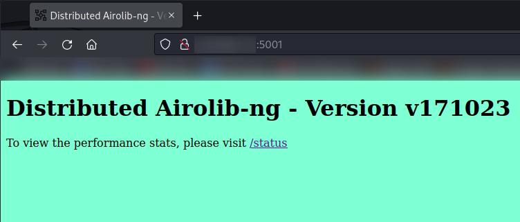
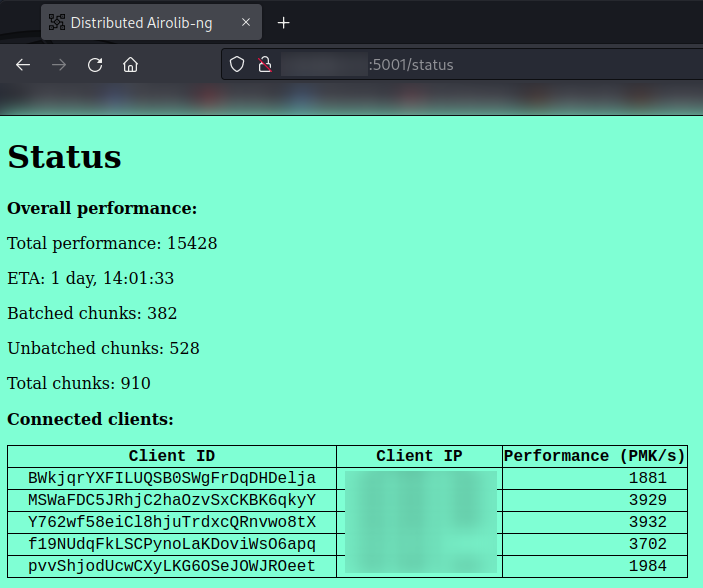

# Distributed Airolib-ng
### Airolib-ng with a <i>distributed system</i> approach

Version v241023

## What is Airolib-ng ?

Airolib-ng is a tool included in the <a href="https://github.com/aircrack-ng/aircrack-ng">Aicrack-ng</a> suite used specifically to precompute PMKs when performing Wireless Pentests.

The idea is to pre-calculate the passwords before performing the Wireless Pentest activity itself, in order to gain a significant advantage later, in terms of cracking time.

## What is the problem with Airolib-ng?

Airolib-ng itself doesn't have problems. However, it stores the precomputed PMKs and all its related data in a .DB file (an SQLite Database).

This is ideal for relatively small databases, but slowly becomes inefficient with larger and larger databases. Preformance start to degrade and datbase files become more and more sluggish.

## What is the solution?

For very large wordlists, one does not create a single database, but rather, many smaller pieces of database.

This way, smaller amounts of passwords can be computed at a time and performance does not degrade over time. 

Better yet, if these database portions are distributed over multiple endpoints, crack times get decreased significantly.

Hence, the need of a distributed system approach.

## How does this work?

In short, the server listens for hosts who want to participate in the batch.

When a client connects, it will request a chunk to the server.

The client then batches the chunk, and when done, will submit said chunk back to the server.

Each chunk contains 1 million passwords <b>at most</b> (by default, but can be modified).

## Usage:
### Requirements:

This repo uses <a href="https://github.com/SpeWnz/ZHOR_Modules">ZHOR_Modules</a> as well as some other Python modules specified in the requirements.txt file. Make sure to install those first.

Endpoints running the client must have, of course, the Aircrack-ng suite installed (usually comes pre-installed with Kali distributions).

### Workflow
<ol>

<li>
Generate database chunks by issuing the following command:
 

<code>python3 make-db-chunks.py &ltwordlist&gt &ltssid list&gt</code>

This will generate a folder containing all the chunks and a json file used by the server to keep track of the work. By default, the folder name will be the current date and timestamp.

</li>

<li>
If you want to host a server, check the parameters by issuing the following command:
 

<code>python3 server.py &ltport&gt &ltchunks folder&gt</code>

</li>

<li>
If you want to run the client, check the parameters by issuing the following command:
 

<code>python3 client.py -h</code>

</li>

<li>
With a browser, navigate to the server IP address to check the current status:

Main page: 

Performance dashboard:

</li>

</ol>

## Features
<ul>
<li>"Safe multithread": The script will prevent you from launching more airolib-ng instances than your core count.</li>
<li>Batch limit: it is possible to batch only a maximum amout of chunk if specified.</li>
<li>Continuous polling: clients will keep looking for new jobs from the server, never shutting down. Ideal in situations where clients are always online (for example, when clients are executed as a background service).</li>
<li>(TODO) Aircrack-ng adapter: a script that can ingest all of the db chunks and crack the password.</li>
<li>(TODO) Keyboard interrupt handling for the client.</li>

</ul>

## DISCLAIMER
<ul>
<li>The author of this repo does not hold responsible for any misuse or malicious use of the tools and scripts provided here.</li>
<li>This repo is supposed to be used inside a private or work LAN in which, presumably, all endpoints are trusted. While it is possible to use this repo with clients connecting outside of a LAN, it is not recommended for security purposes. If you want to, do so <b>at your own risk.</b></li>
<li>The author does not own Airolib-ng nor any tool of the Aircrack-ng suite. All rights belong to the respective owners.</li>
</ul>
